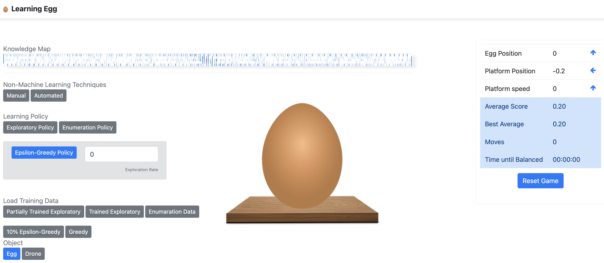

# The Learning Egg

The Learning Egg is a software implementation of a Machine Learning Model. The application uses Reinforcement Learning to demonstrate how a learning agent can solve a problem using Machine Learning.

[View Demo](https://akaninyene.com/projects/the-learning-egg/)

## The Problem

The problem consists of an egg sitting on a platform that rotates left and right, where the egg can lean to the left and the right to shift the platform in either direction.

## The Goal

The objective is for the platform to be balanced and not moving, or as close to being balanced as possible.

## Research

**A Machine Learning Model For Training Your AI**
Akaninyene Udoeyop

<small>Machine Learning will play an increasing role in solving some of the world’s greatest problems. In order to solve these problems, they will need to be mapped into Machine Learning Models.  A Machine Learning Model in Reinforcement Learning is the blueprint that defines the states, actions, rewards, and other elements that are relevant to a learning environment. This includes the logic and policies that guide learning agents to an optimal or nearly optimal solution to a problem. This paper outlines a process for developing Machine Learning Models that is extensible and can be applied to solving problems. This includes a process for implementing a data model using multi-dimensional arrays for efficient data processing. An evaluation of learning policies is also included, assessing their performance compared to manual and automated approaches

[View Paper](https://akaninyene.com/docs/A%20Machine%20Learning%20Model%20for%20Training%20Your%20AI%20-%20.pdf)